# Loan Approval Prediction - Binary Classification Project

**One Sentence Summary:**  
This repository presents a binary classification model to predict loan approval status using a synthetic dataset based on financial application features.  
(Kaggle-style structure, data link: https://www.kaggle.com/datasets/lorenzozoppelletto/financial-risk-for-loan-approval)

---

## Overview

This project aims to predict whether a loan will be approved based on four key features: CreditScore, AnnualIncome, EmploymentStatus, and TotalDebtToIncomeRatio.  
We used a Logistic Regression model to evaluate prediction performance.  
The final model achieved an **accuracy of 86.8%** and an **F1-score of 0.70** for the approved class, despite class imbalance.

---

## Summary of Workdone

### Data

- **Type**: Tabular, structured CSV file  
- **Input features**:  
  - CreditScore (numerical)  
  - AnnualIncome (numerical)  
  - EmploymentStatus (categorical: Employed, Self-Employed, Unemployed)  
  - TotalDebtToIncomeRatio (numerical)  
- **Target variable**: LoanApproved (binary: 0 = Not Approved, 1 = Approved)  
- **Size**: 20,000 samples  
- **Train/Test split**: 80% train, 20% test  

No missing values were present. No validation set was used, as model complexity was low.

**Initial Data Overview:**

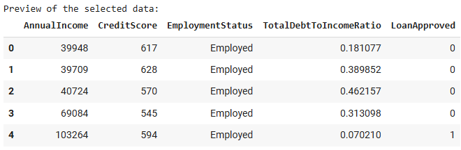
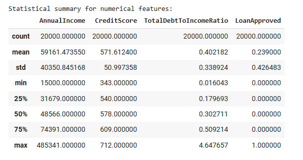

> This preview shows 5 initial rows, confirms no nulls, and gives basic statistics like mean income and credit score range.

### Preprocessing / Clean up

- One-hot encoding applied to EmploymentStatus  
- StandardScaler applied to the 3 numerical features  
- Outliers visualized but not removed  
- Features were scaled to ensure comparability during training

**Feature Summary Table**

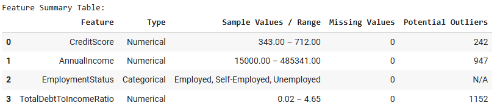

> CreditScore and Income have wide ranges with many outliers. EmploymentStatus is categorical and required encoding. This summary guided scaling decisions.

### Data Visualization

**Credit Score by Loan Approval**

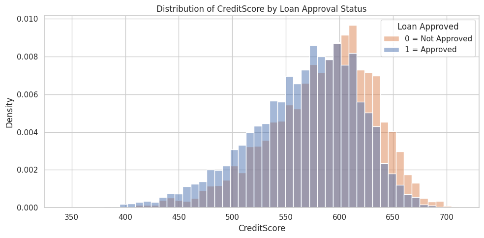

> Approved applicants mostly have scores above 600. Rejected ones cluster below 580, showing CreditScore is a strong predictive feature.

**Annual Income by Loan Approval**

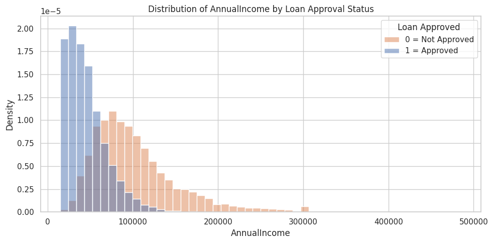

> Income is right-skewed. Approved loans appear more often in the 40K–80K range. Very high-income outliers exist but don’t dominate.

**Debt-to-Income Ratio by Loan Approval**

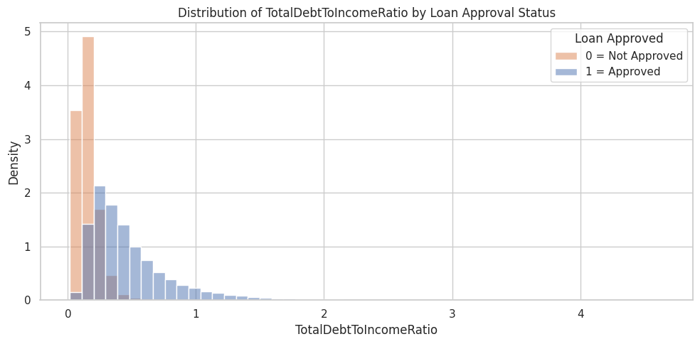

> Low DTI (< 0.5) corresponds to more approvals. Applicants with DTI > 1 are rarely approved, reflecting financial risk thresholds.

**Employment Status Distribution**

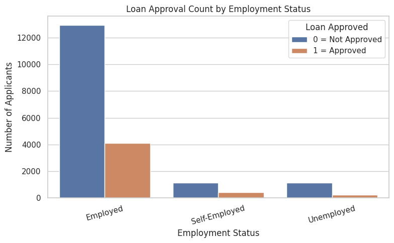

> Most approved applicants are employed. Self-employed and unemployed are much more likely to be rejected. A strong categorical predictor.

---

### Problem Formulation

- **Input**: `[CreditScore, AnnualIncome, EmploymentStatus_onehot, TotalDebtToIncomeRatio]`  
- **Output**: `LoanApproved (0 or 1)`  
- **Model Used**: LogisticRegression  
- **Why?**: Simple, interpretable, fast to train. Ideal for binary classification on tabular data.

---

### Training

- **Environment**: Google Colab  
- **Libraries**: pandas, scikit-learn, matplotlib, seaborn  
- **Training Time**: Less than 1 minute  
- **No tuning or early stopping used** due to model simplicity  
- **No issues** encountered during training

**Scaling Results**

**Credit Score: Before vs After Scaling**

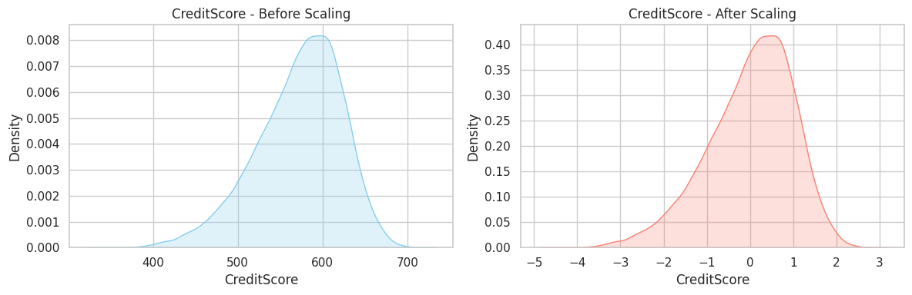

> Distribution is centered at 0 and still bell-shaped. Values normalized between -3 and +3. Prevents large-scale domination.

**Annual Income: Before vs After Scaling**

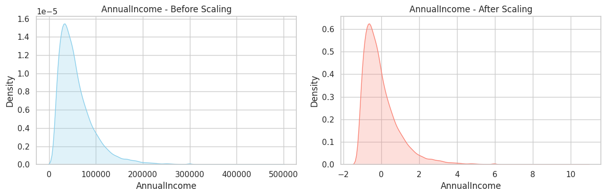

> Original values stretched up to $480K. After scaling, the range is tighter but still skewed. Now better balanced with other inputs.

**Debt-to-Income Ratio: Before vs After Scaling**

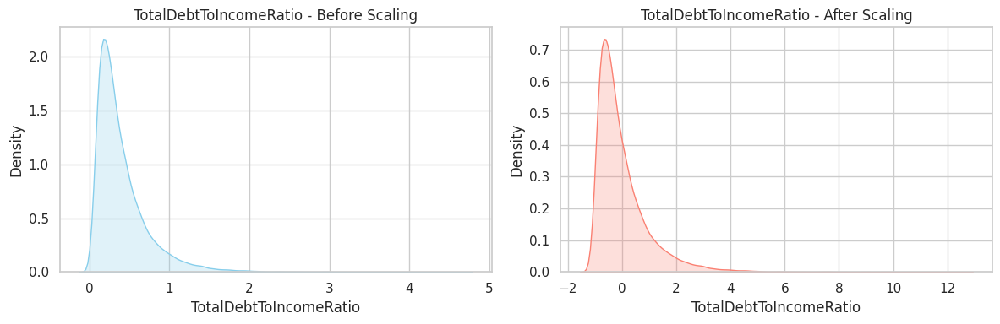

> Outliers were controlled via scaling. Central mass preserved, skew remains. Feature now ready for model training.

---

### Performance Comparison

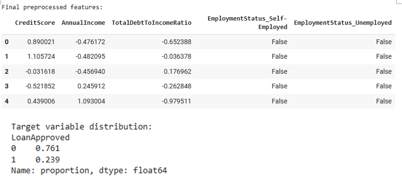

- **Accuracy**: 86.8%  
- **Precision (class 1)**: 0.77  
- **Recall (class 1)**: 0.63  
- **F1-score (class 1)**: 0.70  

> Logistic Regression handled imbalance reasonably. Confusion matrix shows ~600 true positives for the approved class.

---

## Conclusions

- CreditScore and DebtRatio are the most influential features
- EmploymentStatus shows clear class separation
- Logistic Regression performed well for this simple use case

---

## Future Work

- Try tree-based models: RandomForest, GradientBoosting  
- Use validation split or cross-validation  
- Apply SMOTE to rebalance the dataset  
- Add feature importance or SHAP plots for model interpretability

---

## How to Reproduce Results

1. Open `Loan_Project_Wonho_Jeong.ipynb` in Colab or Jupyter
2. Run all cells sequentially
3. Outputs:
   - Preprocessing
   - Graphs
   - Model results
   - Submission file

---

## Overview of Files in Repository

| File | Description |
|------|-------------|
| `Loan_Project_Wonho_Jeong.ipynb` | Main code notebook |
| `loan_approval_submission_Wonho Jeong.csv` | Final test predictions |
| `README.md` | Project documentation |
| `project_images/` | All analysis and result visualizations |
| `README_TEMPLATE.md` | Original structure from professor |

---

## Software Setup / Data

```bash
pip install pandas scikit-learn matplotlib seaborn
```

- Dataset: [Kaggle Dataset](https://www.kaggle.com/datasets/lorenzozoppelletto/financial-risk-for-loan-approval)

---

## Citations

- Zoppelletto, Lorenzo. *Financial Risk for Loan Approval*, Kaggle.  
- scikit-learn documentation  
- Logistic Regression literature

