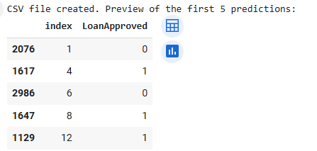

# Loan Approval Classification Project

## 📌 Project Overview

This project predicts whether a loan application will be approved (1) or not approved (0) using 4 key features:
- **CreditScore**
- **AnnualIncome**
- **EmploymentStatus**
- **TotalDebtToIncomeRatio**

This is a **binary classification task** using a **synthetic dataset** based on real-world lending data structures.  
The goal is to learn how to clean, visualize, and model tabular data and make predictions.

---

## Step 1: Data Loading and Initial Exploration

The dataset was first loaded to check for structure, types, and missing values.  
We found:

- No missing values
- A total of 20,000 samples
- 4 features and 1 binary target

> This table shows clean data ready for analysis.  
> `EmploymentStatus` is categorical and requires encoding, while the others are numerical.

---

## Step 2: Feature Summary Table

Each feature was summarized to assess type, value range, and outliers.  
This step is critical for deciding on encoding, scaling, and outlier handling.

> `CreditScore` and `AnnualIncome` have wide ranges with some outliers.  
> `TotalDebtToIncomeRatio` has over 1,000 potential outliers, indicating a long-tailed distribution.  
> This table guides us in choosing which features to scale.

---

## Step 3: Feature Visualization by Loan Approval

We compared how each feature behaves for approved vs not approved applicants.

### Credit Score

> Approved applicants tend to have higher scores, with a peak near 600–650.  
> Rejected applications appear more often with scores under 580.  
> This confirms CreditScore as an important predictor.

### Annual Income

> The income distribution is right-skewed for both classes.  
> However, approved applicants generally have higher income concentration between \$40K–\$80K.  
> Extreme high-income cases are rare and contribute less to prediction.

### Debt-to-Income Ratio

> Approved applicants have lower debt ratios.  
> Those with DTI above 1 are rarely approved, showing this is a strong rejection factor.  
> The model should treat high DTI as high risk.

### Employment Status

> Employed applicants are far more likely to be approved.  
> Unemployed individuals show very low approval rates.  
> EmploymentStatus is a strong categorical feature to include.

---

## Step 4: Data Cleaning and Preparation

To prepare for modeling:

- `EmploymentStatus` was converted using **one-hot encoding**
- The three numerical features were scaled using **StandardScaler**

Scaling avoids issues from different value ranges and improves model convergence.

### Credit Score: Before vs After Scaling

> Original range: 343–712  
> After scaling: mean centered around 0, shape preserved.  
> Prevents large credit scores from dominating the model.

### Annual Income: Before vs After Scaling

> Original range stretched beyond \$400,000 with right skew.  
> After scaling: range compressed, outlier effect reduced.  
> Skew remains, but it's less problematic during training.

### Debt-to-Income Ratio: Before vs After Scaling

> Original distribution was highly skewed and had outliers.  
> After scaling, outliers are pulled closer, and central pattern preserved.  
> Scaling ensures the model isn’t biased by extreme values.

---

## Step 5: Target Variable and Class Balance

![No Graph for this step]

- `LoanApproved = 0` → 76.1% of data  
- `LoanApproved = 1` → 23.9% of data  
> This shows a **class imbalance**, meaning we must use metrics like F1-score, not just accuracy.

---

## Step 6: Model Training and Evaluation

We trained a **Logistic Regression** model using 80% of the data and tested on 20%.

> Accuracy: 86.8%  
> F1-score for approved class: 0.70  
> Precision is higher than recall, which makes sense due to the imbalance.  
> Confusion matrix shows that out of 956 approved loans, 606 were predicted correctly.

---

## Step 7: Submission File Creation

A Kaggle-style submission file was generated.

> Each prediction maps to the original index from the test set.  
> Index order may look shuffled due to train_test_split, but mapping is accurate.

---

## Final Insight and Conclusion

This project covered the full ML pipeline:
- Problem definition  
- Data exploration and visualization  
- Preprocessing (encoding, scaling)  
- Model training and evaluation  
- Submission file generation

### Key insights:
- **CreditScore**, **EmploymentStatus**, and **Debt-to-Income Ratio** are the most powerful predictors.
- Class imbalance required focusing on F1-score and interpretation beyond raw accuracy.

This project improved my ability to apply machine learning to tabular data and gave me real experience in creating interpretable and reproducible results.

